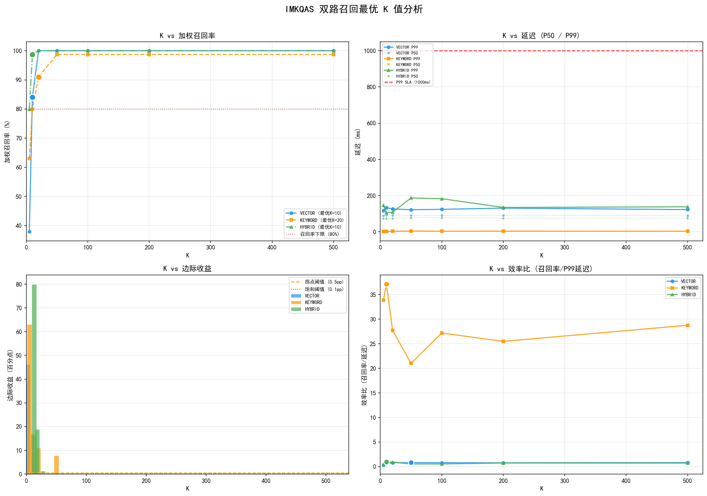

# IMKQAS 双路召回 K 值调优报告

**生成时间**: 2026-07-03 15:36:50
**服务器**: http://localhost:8080
**K值范围**: 5~500 (7个采样点)
**约束条件**: 召回率≥80%, P99延迟<1000ms

## 最优K值推荐

| 通路 | 最优K | 拐点K | 饱和K | 召回率 | P99延迟 | SLA |
|------|-------|-------|-------|--------|---------|-----|
| VECTOR | 10 | 50 | 50 | 84.0% | 133.7ms | ✓ |
| KEYWORD | 20 | 100 | 100 | 91.0% | 3.3ms | ✓ |
| HYBRID | 10 | 50 | 50 | 98.7% | 105.8ms | ✓ |

## VECTOR 通路详细指标

| K | 召回率% | 精确率% | P50(ms) | P99(ms) | 实际数 | 边际收益pp |
|---|---------|---------|---------|---------|--------|-----------|
| 5 | 37.88 | 42.92 | 89.3 | 117.6 | 5 | 37.88 |
| 10 | 84.01 | 40.30 | 91.6 | 133.7 | 10 | 46.13 **← 最优** |
| 20 | 100.00 | 36.78 | 91.1 | 126.4 | 12 | 15.99 |
| 50 | 100.00 | 36.78 | 91.1 | 122.4 | 12 | 0.00 ← 拐点 |
| 100 | 100.00 | 36.78 | 90.5 | 124.3 | 12 | 0.00 |
| 200 | 100.00 | 36.78 | 91.0 | 130.9 | 12 | 0.00 |
| 500 | 100.00 | 36.78 | 89.8 | 122.9 | 12 | 0.00 |

## KEYWORD 通路详细指标

| K | 召回率% | 精确率% | P50(ms) | P99(ms) | 实际数 | 边际收益pp |
|---|---------|---------|---------|---------|--------|-----------|
| 5 | 63.03 | 87.50 | 0.6 | 1.9 | 2 | 63.03 |
| 10 | 79.97 | 64.75 | 1.0 | 2.2 | 4 | 16.94 |
| 20 | 91.01 | 50.32 | 1.0 | 3.3 | 7 | 11.04 **← 最优** |
| 50 | 98.70 | 39.81 | 1.7 | 4.7 | 11 | 7.69 |
| 100 | 98.70 | 39.81 | 1.4 | 3.6 | 11 | 0.00 ← 拐点 |
| 200 | 98.70 | 39.81 | 1.3 | 3.9 | 11 | 0.00 |
| 500 | 98.70 | 39.81 | 1.2 | 3.4 | 11 | 0.00 |

## HYBRID 通路详细指标

| K | 召回率% | 精确率% | P50(ms) | P99(ms) | 实际数 | 边际收益pp |
|---|---------|---------|---------|---------|--------|-----------|
| 5 | 79.86 | 63.16 | 73.9 | 145.7 | 5 | 79.86 |
| 10 | 98.74 | 43.26 | 74.4 | 105.8 | 10 | 18.89 **← 最优** |
| 20 | 100.00 | 36.78 | 74.6 | 109.0 | 12 | 1.26 |
| 50 | 100.00 | 36.78 | 77.9 | 187.1 | 12 | 0.00 ← 拐点 |
| 100 | 100.00 | 36.78 | 78.3 | 183.0 | 12 | 0.00 |
| 200 | 100.00 | 36.78 | 75.3 | 134.6 | 12 | 0.00 |
| 500 | 100.00 | 36.78 | 75.7 | 138.3 | 12 | 0.00 |

## 压力测试结果

| 通路 | K | P50 | P95 | P99 | P999 | QPS | 成功率 | SLA |
|------|---|---|-----|-----|------|-----|--------|-----|
| VECTOR | 10 | 108.06ms | 164.13ms | 176.35ms | 177.72ms | 34.04 | 100% | ✓ |
| KEYWORD | 20 | 12.01ms | 22.98ms | 25.03ms | 25.72ms | 297.83 | 100% | ✓ |
| HYBRID | 10 | 151.53ms | 175.72ms | 182.3ms | 186.8ms | 25.81 | 100% | ✓ |

## 生产配置建议

```yaml
imkqas:
  rag:
    retrieval:
      initial-top-k: 10
      rerank-top-k: 5
```

