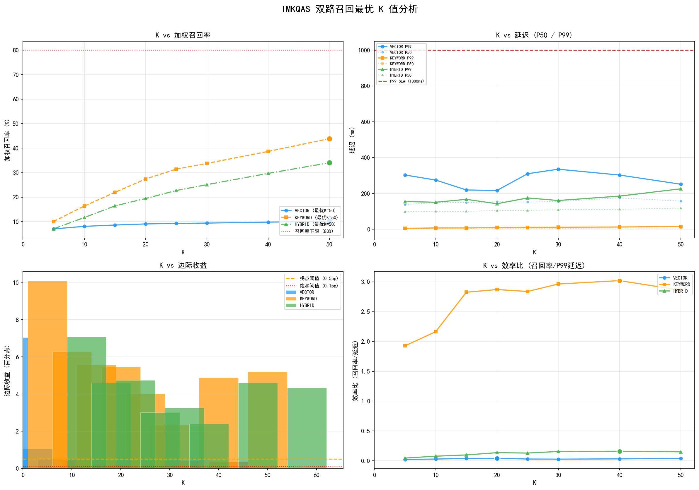

# IMKQAS 双路召回 K 值调优报告

**生成时间**: 2026-08-17 13:32:07
**服务器**: http://localhost:8080
**K值范围**: 5~50 (8个采样点)
**约束条件**: 召回率≥80%, P99延迟<1000ms

## 最优K值推荐

| 通路 | 最优K | 拐点K | 饱和K | 召回率 | P99延迟 | SLA |
|------|-------|-------|-------|--------|---------|-----|
| VECTOR | 50 | 20 | 50 | 10.2% | 251.4ms | ✗ |
| KEYWORD | 50 | 50 | 50 | 43.9% | 15.3ms | ✓ |
| HYBRID | 50 | 50 | 50 | 34.0% | 226.0ms | ✓ |

## VECTOR 通路详细指标

| K | 召回率% | 精确率% | P50(ms) | P99(ms) | 实际数 | 边际收益pp |
|---|---------|---------|---------|---------|--------|-----------|
| 5 | 7.04 | 19.40 | 138.5 | 303.1 | 5 | 7.04 |
| 10 | 8.09 | 12.50 | 148.7 | 274.8 | 10 | 1.05 |
| 15 | 8.63 | 9.33 | 149.0 | 219.5 | 15 | 0.54 |
| 20 | 9.08 | 7.45 | 153.6 | 216.7 | 20 | 0.45 ← 拐点 |
| 25 | 9.26 | 6.16 | 151.9 | 310.1 | 25 | 0.18 |
| 30 | 9.42 | 5.23 | 154.8 | 335.2 | 30 | 0.16 |
| 40 | 9.81 | 4.20 | 175.6 | 302.7 | 40 | 0.39 |
| 50 | 10.18 | 3.60 | 157.3 | 251.4 | 50 | 0.36 **← 最优** |

## KEYWORD 通路详细指标

| K | 召回率% | 精确率% | P50(ms) | P99(ms) | 实际数 | 边际收益pp |
|---|---------|---------|---------|---------|--------|-----------|
| 5 | 10.08 | 32.13 | 2.0 | 5.2 | 5 | 10.08 |
| 10 | 16.38 | 29.55 | 3.4 | 7.6 | 10 | 6.29 |
| 15 | 21.94 | 26.80 | 3.8 | 7.8 | 15 | 5.57 |
| 20 | 27.41 | 25.43 | 4.9 | 9.5 | 19 | 5.46 |
| 25 | 31.43 | 23.71 | 5.1 | 11.1 | 24 | 4.02 |
| 30 | 33.77 | 21.25 | 5.4 | 11.4 | 29 | 2.33 |
| 40 | 38.66 | 18.39 | 6.3 | 12.8 | 39 | 4.89 |
| 50 | 43.87 | 16.67 | 6.6 | 15.3 | 49 | 5.21 **← 最优** |

## HYBRID 通路详细指标

| K | 召回率% | 精确率% | P50(ms) | P99(ms) | 实际数 | 边际收益pp |
|---|---------|---------|---------|---------|--------|-----------|
| 5 | 7.08 | 19.60 | 98.4 | 154.8 | 5 | 7.08 |
| 10 | 11.69 | 18.30 | 99.5 | 150.9 | 10 | 4.61 |
| 15 | 16.43 | 17.40 | 100.3 | 167.1 | 15 | 4.74 |
| 20 | 19.44 | 15.95 | 104.9 | 142.6 | 20 | 3.01 |
| 25 | 22.71 | 15.24 | 105.2 | 175.0 | 25 | 3.26 |
| 30 | 25.10 | 14.27 | 109.2 | 160.7 | 30 | 2.39 |
| 40 | 29.70 | 12.93 | 111.6 | 185.2 | 40 | 4.60 |
| 50 | 34.04 | 11.96 | 118.0 | 226.0 | 50 | 4.34 **← 最优** |

## 压力测试结果

| 通路 | K | P50 | P95 | P99 | P999 | QPS | 成功率 | SLA |
|------|---|---|-----|-----|------|-----|--------|-----|
| VECTOR | 50 | 304.62ms | 878.08ms | 1214.72ms | 1572.21ms | 11.0 | 100% | ✗ |
| KEYWORD | 50 | 11.38ms | 16.38ms | 40.28ms | 46.89ms | 319.13 | 100% | ✓ |
| HYBRID | 50 | 342.53ms | 535.27ms | 692.28ms | 778.45ms | 11.09 | 100% | ✓ |

## 生产配置建议

```yaml
imkqas:
  rag:
    retrieval:
      initial-top-k: 50
      rerank-top-k: 10
```

